**Final System** 

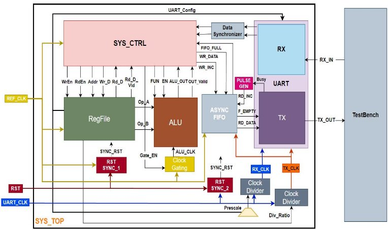

- **Description: -** 

**1.This system contains 10 blocks: -** 

**1) Clock Domain 1 (REF\_CLK)** 

- **RegFile** 
- **ALU** 
- **Clock Gating** 
- **SYS\_CTRL**  
- **Clock Domain 2 (UART\_CLK)** 
- **UART\_TX** 
- **UART\_RX** 
- **PULSE\_GEN** 
- **Clock Dividers** 
- **Data Synchronizers** 
- **RST Synchronizer** 
- **Data Synchronizer** 
- **ASYNC FIFO** 

**CLOCK Domain 1** 

**1) RegFile: -** 

- **Block Interface: -** 

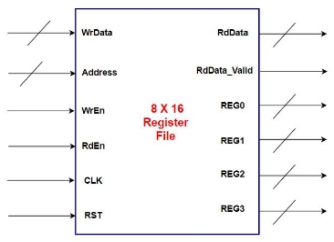

- **Signal Description: -** 

|**Port** |**Direction** |**Width** |**Description** |**Connected to** |
| - | - | - | - | - |
|**CLK** |IN |1 |Clock Signal |TOP Input Port |
|||||(REF\_CLK) |
|**RST** |IN |1 |Active Low Reset |RST\_SYNC |
|**Address** |IN |Parameterized |Address bus |SYS\_CTRL |
|||(default : 4 bits) |||
|**WrEn** |IN |1 |Write Enable |SYS\_CTRL |
|**RdEn** |IN |1 |Read Enable |SYS\_CTRL |
|**WrData** |IN |Parameterized (default : 8 bits) |Write Data Bus |SYS\_CTRL |
|**RdData** |OUT |Parameterized |Read Data Bus |SYS\_CTRL |
|||(default : 8 bits) |||
|**RdData\_Valid** |OUT |1 |Read Data Valid |SYS\_CTRL |
|**REG0** |OUT |Parameterized (default : 8 bits) |Register at Address 0x0 |ALU |
|**REG1** |OUT |Parameterized |Register at Address |ALU |
|||(default : 8 bits) |0x1 ||
|**REG2** |OUT |Parameterized (default : 8 bits) |Register at Address 0x2 |UART |
|**REG3** |OUT |Parameterized |Register at Address |Clock Divider |
|||(default : 8 bits) |0x3 ||

- **Reserved Registers Description: -** 
1) **REG0 (Address: 0x0)**  ALU Operand A 
1) **REG1 (Address: 0x1)**  ALU Operand B 
1) **REG2 (Address: 0x2)**  UART Config 

**REG2[0]: Parity Enable              (Default = 1)** 

**REG2[1]: Parity Type**  

`      `**(Default = 0) REG2[7:2]: Prescale** 

`                   `**(Default = 32)**

4) **REG3 (Address: 0x3)**  Div Ratio 

**REG3[7:0]: Division ratio                    (Default = 32)**

2) **ALU:** 
- **Block Interface: -** 

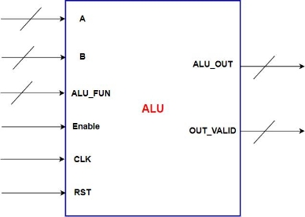

- **Signal Description: -** 

|**Port** |**Direction** |**Width** |**Description** |**Connected to** |
| - | - | - | - | - |
|**CLK** |IN |1 |Clock Signal |CLK\_GATE |
|**RST** |IN |1 |Active Low Reset |RST\_SYNC |
|**A** |IN |Parameterized |Operand A |RegFile |
|||(default : 8 bits) ||(REG0) |
|**B** |IN |Parameterized (default : 8 bits) |Operand B |RegFile (REG1) |
|**ALU\_FUN** |IN |Parameterized |ALU Function |SYS\_CTRL  |
|||(default : 4 bits) |||
|**Enable** |IN |1 |ALU Enable |SYS\_CTRL |
|**ALU\_OUT** |OUT |Parameterized |ALU Result |SYS\_CTRL  |
|||(default : 8 bits) |||
|**OUT\_VALID** |OUT |1 |Result Valid |SYS\_CTRL  |

3) **Clock Gating: -** 
- **Block Interface: -** 

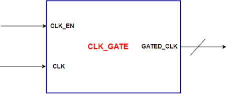

- **Signal Description: -** 

|**Port** |**Direction** |**Width** |**Description** |**Connected to** |
| - | - | - | - | - |
|**CLK** |IN |1 |Clock Signal |TOP Input Port |
|||||(REF\_CLK) |
|**CLK\_EN** |IN |1 |Clock Enable |SYS\_CTRL |
|**GATED\_CLK** |out |1 |Gated Clock signal |ALU |
||||||

4) **SYS\_CTRL:**  
- **Block Interface: -** 

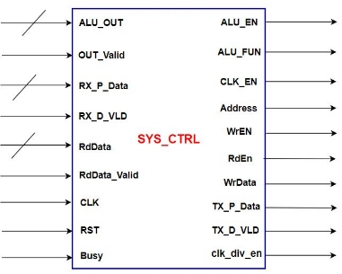

- **Signal Description: -** 

|**Port** |**Direction** |**Width** |**Description** |**Connected to** |
| - | - | - | - | - |
|**CLK** |IN |1 |Clock Signal |TOP Input Port |
|||||(REF\_CLK) |
|**RST** |IN |1 |Active Low Reset |RST\_SYNC |
|**ALU\_OUT** |IN |16 |ALU Result  |ALU |
|**OUT\_Valid** |IN |1 |ALU Result Valid |ALU |
|**ALU\_FUN** |OUT |4 |ALU Function signal |ALU |
|**EN** |OUT |1 |ALU Enable signal |ALU |
|**CLK\_EN** |OUT |1 |Clock gate enable |CLK\_GATE |
|**Address** |OUT |4 |Address bus |RegFile |
|**WrEn** |OUT |1 |Write Enable |RegFile |
|**RdEn** |OUT |1 |Read Enable |RegFile |
|**WrData** |OUT |8 |Write Data Bus |RegFile |
|**RdData** |IN |8 |Read Data Bus |RegFile |
|**RdData\_Valid** |IN |1 |Read Data Valid |RegFile |
|**RX\_P\_DATA** |IN |8 |UART \_RX Data |UART\_RX |
|**RX\_D\_VLD** |IN |1 |RX Data Valid |UART\_RX |
|**TX\_P\_DATA** |OUT |8 |UART \_TX Data |UART\_TX |
|**TX\_D\_VLD** |OUT |1 |TX Data Valid |UART\_TX |
|**clk\_div\_en** |OUT |1 |Clock divider enable |CLKDiv |

**CLOCK Domain 2** 

**1) Clock Divider: -** 

- **Block Interface: -** 

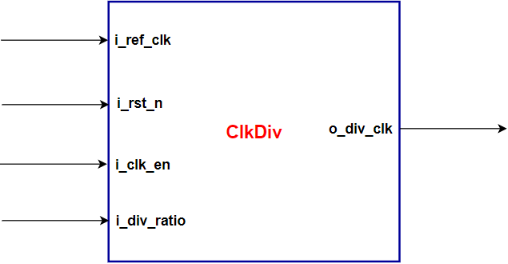

- **Signal Description: -** 

|**Port** |**Direction** |**Width** |**Description** |**Connected to** |
| - | - | - | - | - |
|**I\_ref\_clk** |IN |1 |Clock Signal |TOP Input Port |
|||||(UART\_CLK) |
|**I\_rst\_n** |IN |1 |Active Low Async Reset |RST\_SYNC\_2 |
|**I\_clk\_en** |IN |1 |Clock divider enable |1’b1 (Supply) |
|**I\_div\_ratio** |IN |Parameterized (default : 8 bits) |Division ratio |RegFile |
|**O\_div\_clk** |out |1 |Divided clock |UART\_TX |
|||||UART\_RX |

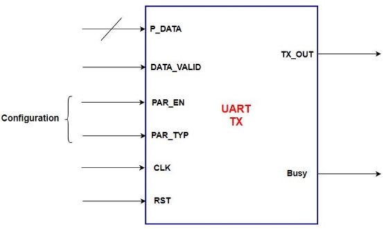

- **Signal Description: -** 

|**Port** |**Direction** |**Width** |**Description** |**Connected to** |
| - | - | - | - | - |
|**CLK** |IN |1 |Clock Signal |CLKDiv |
|**RST** |IN |1 |Active Low  Reset |RST\_SYNC\_2 |
|**PAR\_EN** |IN |1 |Parity Enable |RegFile |
||||||
|**PAR\_TYP** |IN |1 |Parity Type |RegFile |
|**P\_DATA** |IN |Parameterized |Parallel IN Data |ASYNC\_FIFO |
|||(default : 8 bits) |||
|**DATA\_VALID** |IN |1 |IN Data Valid |ASYNC\_FIFO |
|**S\_DATA** |OUT |1 |frame serial bits |TOP Output Port |
|||||(TX\_OUT) |
|**Busy** |OUT |1 |Uart status signal |PULSE\_GEN |

`  `           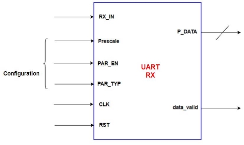

- **Signal Description: -** 

 

|**Port** |**Direction** |**Width** |**Description** |**Connected to** |
| - | - | - | - | - |
|**CLK** |IN |1 |Clock Signal |TOP Input Port |
|||||(UART\_CLK) |
|**RST** |IN |1 |Active Low  Reset |RST\_SYNC\_2 |
|**Prescale** |IN |6 |Prescale |RegFile |
|**PAR\_EN** |IN |1 |Parity Enable |RegFile |
||||||
|**PAR\_TYP** |IN |1 |Parity Type |RegFile |
|**RX\_IN** |IN |1 |frame serial bits |TOP Input Port (RX\_IN) |
|**P\_DATA** |OUT |Parameterized (default : 8 bits) |Parallel Out Data |DATA\_SYNC |
|**DATA\_VLD** |OUT |1 |Out Data Valid |DATA\_SYNC |
||||||
|**PAR\_ERR** |OUT |1 |Frame parity error |TOP Output Port |
|**STP\_ERR** |OUT |1 |Frame stop error |TOP Output Port |

**4) PULSE\_GEN: -** 

- **Block Interface: -** 

  `  `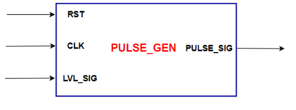           

- **Signal Description: -** 

 

|**Port** |**Direction** |**Width** |**Description** |**Connected to** |
| - | - | - | - | - |
|**CLK** |IN |1 |Clock Signal |TOP Input Port |
|||||(UART\_TX) |
|**RST** |IN |1 |Active Low  Reset |RST\_SYNC\_2 |
|**LVL\_SIG** |IN |1 |Level signal |UART\_TX |
|**PULSE\_SIG** |OUT |1 |Pulse signal |ASYNC\_FIFO |
||||||

**Synchronizers** 

1) **RST\_Sync: -** 
- **Block Interface: -** 

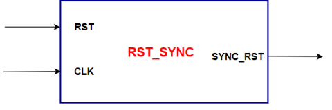

- **Signal Description: -**   

|**Port** |**Direction** |**Width** |**Description** |
| - | - | - | - |
|**RST** |IN |1 |Clock Signal |
|**CLK** |IN |1 |Active Low Async Reset |
|**SYNC\_RST** |OUT |1 |Active Low synchronized |
||||Reset |

2) **Data\_Sync: -** 
- **Block Interface: -**   

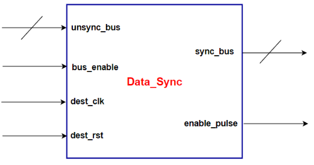

- **Signal Description: -**   

|**Port** |**Direction** |**Width** |**Description** |
| - | - | - | - |
|**unsync\_bus** |IN |8|Unsynchronized  |
||||bus |
|**bus\_enable** |IN |1 |Bus enable signal |
|**dest\_clk** |IN |1 |Destination Clock Signal |
|||||
|**dest\_rst** |IN |1 |Destination Active Low  Reset |
|**sync\_bus** |OUT |8 |synchronized  |
||||bus |
|**enable\_pulse\_d** |OUT |1 |enable pulse signal |

3) **ASYNC\_FIFO: -** 

- **Block Interface: -**    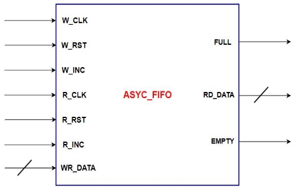

  `  `             

- **Signal Description: -** 

|**Port** |**Width** |**Description** |**Connected to** |
| - | - | - | - |
|W\_CLK |1 |Source domain clock** |`  `TOP Input Port |
||||(REF\_CLK) |
|W\_RST |1 |Source domain Async reset |` `RST\_SYNC\_1 |
|W\_INC |1 |Write operation enable** |`  `SYS\_CTRL |
|R\_CLK |1 |Destination domain clock |RST\_SYNC\_2 |
|R\_RST |1 |Destination domain Async |`  `RST\_SYNC\_2 |
|||reset ||
|R\_INC |1 |Read operation enable |PULSE\_GEN |
|WR\_DATA |Parameterized default ( 8-bits ) |`  `Write Data Bus  |SYS\_CTRL |
|RD\_DATA |Parameterized default ( 8-bits ) |`  `Read Data Bus  |UART\_TX |
|FULL |1 |FIFO Buffer full flag |`  `SYS\_CTRL |
|EMPTY |1 |FIFO Buffer empty flag |UART\_TX |

**Introduction** 

- The system is responsible to do some operation based on the received commands from the master through UART\_RX interface, once the operation is done, the system is responsible to send the result to the master through UART\_TX interface. 

 

- Supported Operations: - 

\1. **ALU Operations: -** 

- **Addition** 
- **Subtraction** 
- **Multiplication** 
- **Division** 
- **AND** 
- **OR** 
- **NAND** 
- **NOR** 
- **XOR** 
- **XNOR** 
- **CMP: A = B** 
- **CMP: A > B** 
- **SHIFT: A >> 1** 
- **SHIFT: A << 1** 

\2. **Register File Operations** 

- **Register File Write** 
- **Register File read** 

- Supported Commands: - 

\1.  **Register File Write command (3 frames)** 

`  `

- **Frame 2** 
- RF\_Wr\_Data  

**Frame 1  Frame 0** RF\_Wr\_CMD 

RF\_Wr\_Addr  (0xAA) 

\2.  **Register File Read command (2 frames)** 

`  `![ref1]

- **Frame 1** 
- RF\_Rd\_Addr  

**Frame 0** 

RF\_Rd\_CMD (0xBB) 

\3.  **ALU Operation command with operand (4 frames)** 

**Frame**  **3 ![ref1]** 

- ALU FUN  

  **Frame 2** Operand B 

  **Frame 1** Operand A 

**Frame 0** 

ALU\_OPER\_W\_OP\_CMD (0xCC) 

\4.  **ALU Operation command with No operand (2 frames)** 

`  `

- **Frame 1** 
- ALU FUN  

**Frame 0** 

ALU\_OPER\_W\_NOP\_CMD (0xDD) 

**System Specifications: -** 

- Reference clock (REF\_CLK) is 50 MHz 
- UART clock (UART\_CLK) is 3.6864 MHz 
- Clock Divider is always on (clock divider enable = 1) 

**Sequence of Operation (Must include in the testbench): -** 

- Initially configuration operations are performed 

  through Register file write operations in addresses 

  (0x2, 0x3). 

- The Master (Testbench) start to send different commands (RegFile Operations, ALU operations) 
- Our system will receive the command frames through UART\_RX, it sent to the SYS\_CTRL block to be processed  
- Once the operation of the command is performed using ALU/RegFile, SYS\_CTRL sends the result to the master through UART\_TX  
- Register File Address Range for normal write/read operations (From 0x4 to 0x15) 
- Register File Addresses reserved for configurations and ALU 

  operands (From 0x0 to 0x3) 

[ref1]: Aspose.Words.d668253d-3ad6-4a20-953d-5785d4c920f6.020.png
